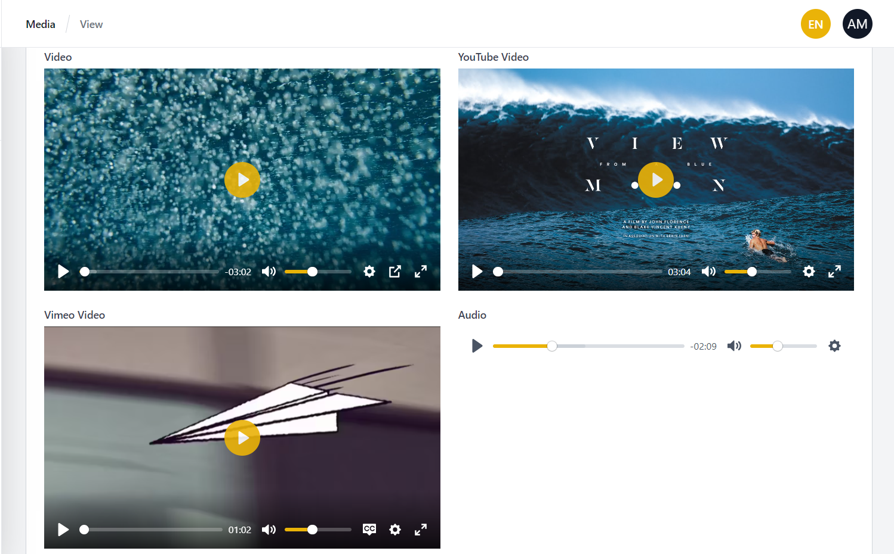
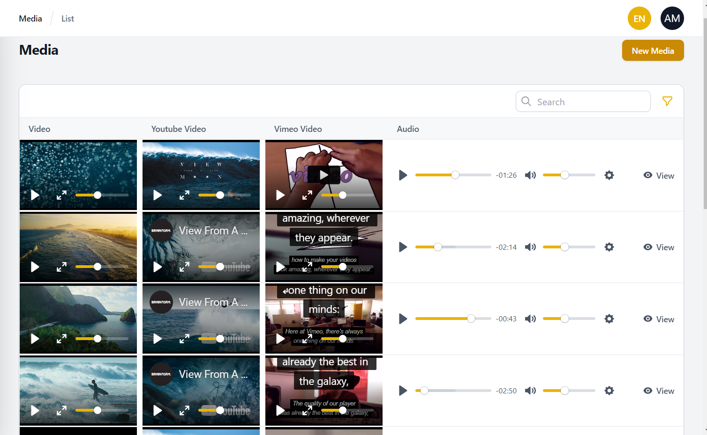

# Filament Audio Video Player

[](https://packagist.org/packages/aymanalhattami/filament-audio-video-player)
[](https://packagist.org/packages/aymanalhattami/filament-audio-video-player)

Filament Audio Video Player using [plyr]( https://github.com/sampotts/plyr) JavaScript library

## Installation

You can install the package via composer:


```bash
composer require aymanalhattami/filament-audio-video-player
```

## Usage

### Form Fields



```php
use Filament\Resources\Form;
use AymanAlhattami\FilamentAudioVideoPlayer\Form\VideoPlayer;
use AymanAlhattami\FilamentAudioVideoPlayer\Form\AudioPlayer;
use AymanAlhattami\FilamentAudioVideoPlayer\Form\YoutubeVideoPlayer;
use AymanAlhattami\FilamentAudioVideoPlayer\Form\ViemoVideoPlayer;
// ...
public static function form(Form $form): Form
{
    return $form
        ->schema([
            // ...
            VideoPlayer::make('video_url'),
            AudioPlayer::make('audio_url'),
            YoutubeVideoPlayer::make('youtube_video_url'),
            VimeoVideoPlayer::make('vimeo_video_url'),
            // ...
        ]);
}
// ...
```

### Table Columns



```php
use Filament\Resources\Table;
use AymanAlhattami\FilamentAudioVideoPlayer\Table\VideoPlayerColumn;
use AymanAlhattami\FilamentAudioVideoPlayer\Table\AudioPlayerColumn;
use AymanAlhattami\FilamentAudioVideoPlayer\Table\YoutubeVideoPlayerColumn;
use AymanAlhattami\FilamentAudioVideoPlayer\Table\VimeoVideoPlayerColumn;
// ...
public static function table(Table $table): Table
{
    return $table
        ->columns([
            // ...
            VideoPlayerColumn::make('video_url'),
            AudioPlayerColumn::make('audio_url'),
            YoutubeVideoPlayerColumn::make('youtube_video_url'),
            VimeoVideoPlayerColumn::make('vimeo_video_url'),
            // ...
        ])
        // ...
}
// ...
```

### More Options
If you want to change any design of the player, you can do so using [plyr CSS customizing](https://github.com/sampotts/plyr#customizing-the-css)
```php
VideoPlayer::make('video_url')
    ->setCss([
        '--plyr-color-main' => '#eab308',
        // ..
    ])
```

If you want to set any configuration for the player, you can do so using [plyr optoins](https://github.com/sampotts/plyr#options)
```php
VideoPlayer::make('video_url')
    ->setOptions([
        "ratio" => "16:9",
        'controls' => ['play-large', 'play', 'fullscreen'],
        // ..
    ])
```

### Changelog

Please see [CHANGELOG](CHANGELOG.md) for more information what has changed recently.

## Contributing

Please see [CONTRIBUTING](CONTRIBUTING.md) for details.

### Security

If you discover any security related issues, please email ayman.m.alhattami@gmail.com instead of using the issue tracker.

## Credits

-   [Ayman Alhattami](https://github.com/aymanalhattami)
-   [All Contributors](../../contributors)

## License

The MIT License (MIT). Please see [License File](LICENSE.md) for more information.

## Laravel Package Boilerplate

This package was generated using the [Laravel Package Boilerplate](https://laravelpackageboilerplate.com).
